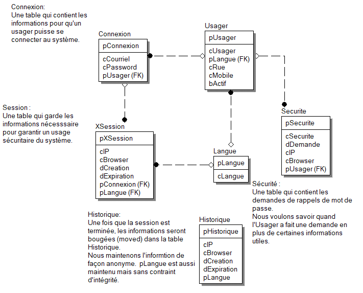

##### Droits d'auteur :copyright: matériel protégé 
 Si vous n'êtes pas étudiant du cours INF3080-030 A2019 vous devez 
 - demander une permission pour l'utilisation de ce matériel;
 - fournir la raison de son usage;

# Séance 7: Langage SQL - DDL, DML, TCL

- Objectif : Expérimenter le DDL, DML, TCL
   
----
**Note** : (_facultatif_) S'il y a des questions dans ce labo, répondez y dans un fichier nommé
`./labo/reponse-labo.md`.  Le fichier doit être dans un format `Markdown`. Utilisez le projet
`in3080-a2019` pour déposer le fichier demandé. Utiliser le même fichier pour tous les exercices.

##### Format du fichier Markdown
 + Séance 2 (Header 1)
 + Exercice {1..n} (H2)
 + Question {1..n} (H4)
 + S`2`.E`3`.Q`1` (strong) `est une valeur qui change bien sûr`
 + La réponse dans une section script (code block)

**Note**: Il est recommandé de versionner vos réponses aux exercices à l'aide
de Git. Un seul dépôt est amplement suffisant pour tous les laboratoires, en
divisant les fichiers dans des répertoires.

 > > Pourquoi versionner vos exercices avec Git: afin de
vous entraîner à utiliser le logiciel (commandes) naturellement.

----

## 0 - Directives

+ Faites le maximum selon vos connaissances;
+ Lire l'atelier complètement;
+ Ce devoir est la suite du devoir précédent;
+ Débuter le devoir;
+ Je vais vérifier (lire) les devoirs;

## 1 - Création de requêtes SQL pour Oracle

Vous devez créer un script  nommé `labo07.sql` qui qui contiendra les réponses pour toutes les questions qui suivent.
Vous devez pour ce travail utiliser le schéma de base de données [modèle A](./modele_labo.png).

+ a) Écrire une requête qui efface la plus petite pLangue qui n'est pas dans une relation (qui n'est pas un clé étrangère);
+ b) 
+ c) 
+ d) 
+ e)
+ f)

## 2 - Exécution de vitre script

+ Q1. Comment est possible d'exécuter un script dans SQL*plus ?

### FIN.

---

Auteur Guy Francoeur :copyright: version A2019
